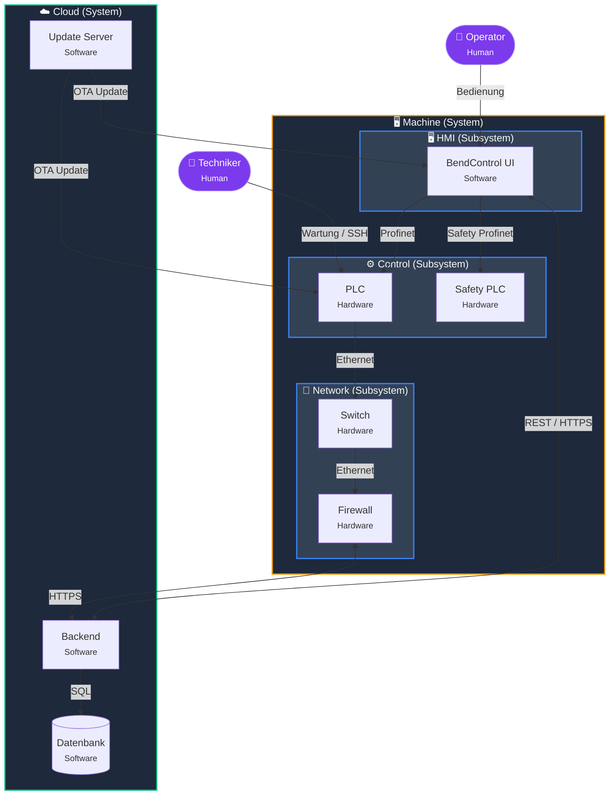
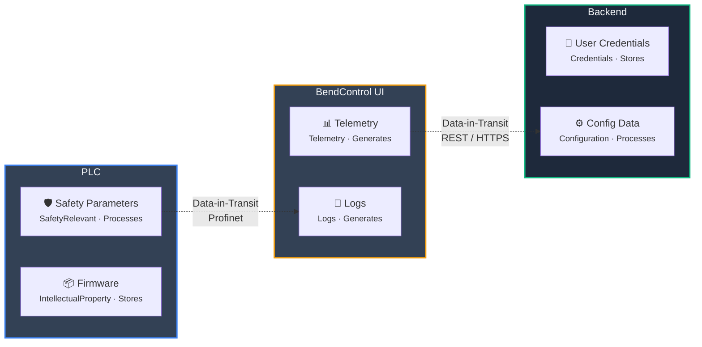
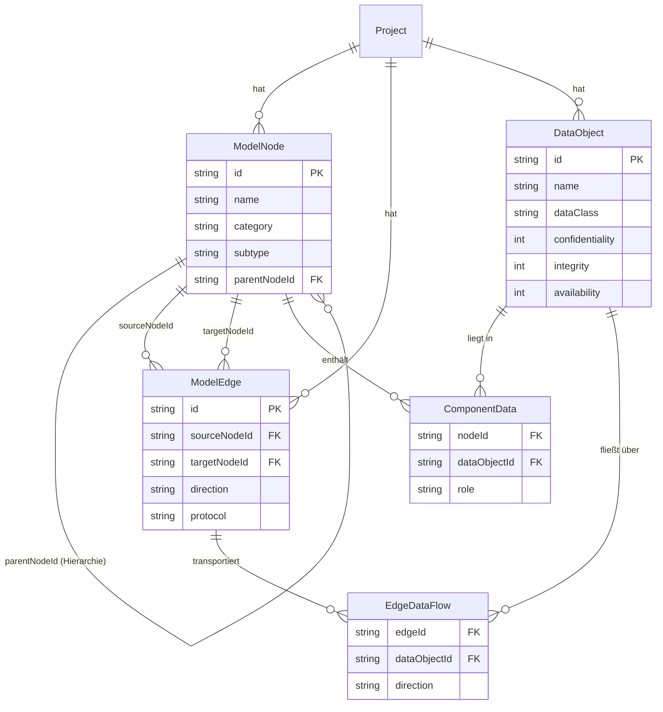

# Secudo – Product Security Assessment Tool
## Requirements

---

## 0. Vision
Secudo ist ein webbasiertes Security-Assessment-Tool für Produkt- und Systemarchitekturen.  
Es kombiniert ein **kanonisches Systemmodell** mit **normbasierten Fragen**, **Risikobewertung** und **automatischer Maßnahmenableitung**.

Ziele:
- Ein zentrales, kollaboratives Sicherheitsmodell pro Produkt
- Normgerechte Bewertung nach IEC 62443
- Ableitung von Risiken und Maßnahmen pro Asset
- Automatischer Security-Report
- **Schnelle Modellierung aus natürlicher Sprache** (KI-Assistenz)

Zielgruppen:
- **Manufacturing Engineers** (50–500 Mitarbeiter): Visuelle Modellierung, schnelles Assessment
- **Consultants & Systemintegratoren** (1–50): Multi-Projekt-Support, Reports
- **Enterprise Security Teams** (1000+): Erweiterte RBAC, Audit Trails, API-Integration

---

## 1. Technology Stack (MVP)

### 1.1 Sprache & Architektur
- Sprache: TypeScript
- Architektur: Webanwendung (Client–Server)

### 1.2 Frontend
- Framework: Next.js (React, App Router)
- Styling: Tailwind CSS
- Diagramm-Editor: React Flow

### 1.3 Backend
- Backend: Next.js Route Handlers
- Authentifizierung: Auth.js (NextAuth)
- RBAC: eigene Rollenlogik

### 1.4 Datenbank
- DB: PostgreSQL
- ORM: Prisma

### 1.5 Report-Export
- PDF-Export: Playwright (HTML → PDF)

### 1.6 Deployment
- **Docker-Container**
- Cloud oder On-Prem

---

## 2. Design & Branding

### 2.1 Zielwirkung
- Modernes SaaS-Interface
- Klare, minimalistische Oberfläche
- Technischer, ingenieurmäßiger Look

### 2.2 Login-Screen Branding
Beim ersten Aufruf sieht der Nutzer:

Zentrales Element:
- Großer Schriftzug: **SECUDO**

Stil:
- Retro-Pixel-Font
- Orange-gelber Farbverlauf
- Weiche, leicht verschwommene Kanten
- Leichter Glow
- Dunkler Hintergrund

Designwirkung:
- Mischung aus altem Adventure-Game-Titel
- moderner Glüheffekt
- technisch und markant

Animation:
- Schrift blendet weich ein
- leichter Glow-Puls
- Dauer: ca. 1–2 Sekunden

Darunter:
- Login-Formular

---

## 3. Benutzer & Rollen

### 3.1 Systemrollen
- User
- Admin

### 3.2 Projektrollen
| Rolle  | Rechte |
|--------|--------|
| Admin  | Projekt verwalten, Rollen vergeben, alles bearbeiten |
| Editor | Modell, Assets, Fragen, Antworten bearbeiten |
| Viewer | Nur lesen |

---

## 4. Authentifizierung

### 4.1 Login
- E-Mail
- Passwort

### 4.2 Registrierung
Felder:
- Name
- E-Mail
- Passwort
- Jobbezeichnung
- Company Level (Enum)

Company Level Beispiele:
- SME
- Enterprise
- Consultant
- Student

---

## 5. Dashboard nach Login

Anzeige:
- Liste „Kürzlich bearbeitete Projekte“
- Sortiert nach letztem Zugriff

Aktionen:
- Neues Projekt erstellen
- Projekt im globalen Katalog suchen

---

## 6. Projektverwaltung

### 6.1 Projekt anlegen
Felder:
- Projektname (Pflicht)
- Beschreibung
- Norm (MVP: IEC 62443)
- minRoleToView (Default: any)

Optionen:
- any
- viewer
- editor
- admin
- private

Nach Erstellung:
- Ersteller wird Projekt-Admin
- Projekt öffnet automatisch

---

## 7. Projektlayout

Navigation im Projekt:
1. Kanonisches Modell
2. Asset-Bewertung
3. Norm-Fragen
4. Findings & Maßnahmen
5. Bericht

---

## 8. Kanonisches Modell (Graph)

### 8.1 Ziel
Zentrales, eindeutiges Systemmodell mit stabilen IDs.  
Das Modell ist die **Single Source of Truth** für:
- Komponenten/People/Interfaces
- verschachtelte Strukturen (Systeme → Subsysteme → Komponenten)
- Datenobjekte (Information Assets), die **in Komponenten liegen** oder **über Interfaces fließen**

#### Beispielarchitektur (Mermaid)



#### Datenobjekte im Modell (Mermaid)



---

### 8.2 Knotentypen

#### Komponente
- Kategorie: `Component`
- Subtypen:
  - Software
  - Hardware
  - Mixed

Beispiele:
- HMI
- PLC
- Backend
- Cloud Service
- Update Server

#### Mensch
- Kategorie: `Human`
- Subtypen:
  - Operator
  - Techniker
  - Administrator

---

### 8.3 Verschachtelte Komponenten (Hierarchie)

**Anforderung:** Komponenten müssen verschachtelbar sein (Tree/Graph-Hierarchie).  
Beispiele:
- System `Machine`  
  - Subsystem `Control`  
    - Component `PLC`
    - Component `Safety PLC`
  - Subsystem `HMI`  
    - Component `BendControl UI`
    -P

#### Regeln
- Jeder Node kann optional einen `parentNodeId` haben.
- Ein Node darf nicht sein eigener Parent sein.
- Es darf keine Zyklen in der Parent-Kette geben (acyclic).
- UI muss Hierarchie sichtbar machen:
  - Collapse/Expand von Subtrees
  - Breadcrumb im Node-Editor (z. B. `Machine > Control > PLC`)
- React Flow Darstellung:
  - MVP: “Group Nodes” (Container) oder visuell markierte Parent-Beziehung
  - Alternativ: Tree-Sidebar + Canvas (nur wichtigste Ebene angezeigt)

---

### 8.4 Kanten (Interfaces)

Eigenschaften:
- Quelle
- Ziel
- Richtung:
  - A → B
  - B → A
  - bidirektional
- Name (optional)
- Protokoll (optional)
- Port/Transport optional (später)
- Trust Boundary Marker optional (später)

---

### 8.5 Datenobjekte (Information Assets)

**Anforderung:** Daten müssen modellierbar sein – entweder:
1) **Daten liegen in einer Komponente** (Data-at-rest / Data-in-component)  
2) **Daten fließen über ein Interface** (Data-in-transit / Data-on-edge)

#### 8.5.1 Datenobjekt Definition
Ein Datenobjekt beschreibt eine “Information”, nicht ein File.
Beispiele:
- Benutzerkonten / Credentials
- Konfigurationsdaten
- Produktionsdaten / Logs
- Remote Service Tickets
- Firmware/Update Packages

Felder eines Datenobjekts:
- `id` (stable)
- `name` (z. B. “User Credentials”)
- `description` (optional)
- `dataClass` (Enum, MVP):
  - Credentials
  - PersonalData
  - SafetyRelevant
  - ProductionData
  - Telemetry
  - Logs
  - IntellectualProperty
  - Configuration
  - Other
- `confidentiality` (1–10, optional)
- `integrity` (1–10, optional)
- `availability` (1–10, optional)
- `tags` (optional)

#### 8.5.2 Daten in Komponenten (Data Placement)
Ein Datenobjekt kann einer Komponente “gehören” oder dort liegen:
- Relation: `ComponentData`
  - `componentId`
  - `dataObjectId`
  - `role` (Enum, MVP):
    - Stores
    - Processes
    - Generates
    - Receives
  - `notes` optional

Beispiel:
- Component `Backend` stores `User Credentials`
- Component `PLC` processes `Safety Parameters`

#### 8.5.3 Daten auf Interfaces (Data Flow)
Ein Datenobjekt kann über eine Edge fließen:
- Relation: `EdgeDataFlow`
  - `edgeId`
  - `dataObjectId`
  - `direction` (Enum):
    - SourceToTarget
    - TargetToSource
    - Bidirectional
  - `notes` optional

Beispiel:
- Edge `HMI -> Backend (REST)` sends `Telemetry`
- Edge `Technician -> HMI` sends `Service Commands`

---

### 8.6 Editor-Funktionen

#### Modell-Editor (React Flow)
- Node erstellen
- Node bearbeiten
- Node löschen
- Interface erstellen
- Richtung ändern
- Zoom/Pan
- Auto-Save

#### Hierarchie-Editor (verschachtelt)
- Node in Parent “einsortieren” (Drag & Drop oder Parent-Feld)
- Parent-Knoten als Container (expand/collapse)
- Visualisierung der Hierarchie in Sidebar

#### Datenobjekte
- DataObject erstellen/bearbeiten/löschen
- DataObject einer Komponente zuordnen (Data Placement)
- DataObject einem Interface zuordnen (Data Flow)
- Datenobjekte im Diagramm sichtbar machen:
  - MVP: Badges/Icons auf Node/Edge + Hover-Liste
  - Detailpanel zeigt DataObjects + Beziehung

Alle Elemente:
- besitzen eindeutige IDs
- werden zentral gespeichert
- sind auditierbar (createdAt/updatedAt/author)

---

## 9. Assetliste & Value-Bewertung

### 9.1 Asset-Generierung
Assets entstehen automatisch aus:
- Komponenten
- optional Interfaces
- optional Datenobjekte (später / optional)

MVP-Default:
- Asset = Component
- optional Asset = Edge (Interface)

### 9.2 Value-Bewertung
Pro Asset:
| Feld | Beschreibung |
|------|-------------|
| value | 1–10 |
| kommentar | optional |

Skala:
- 1 = sehr gering
- 10 = kritisch

---

## 10. Normbasierte Fragen (IEC 62443)

### 10.1 Frage-Struktur
Jede Frage enthält:
- id
- Fragetext
- Normreferenz
- Zieltyp:
  - Component
  - Interface
  - DataObject (optional / später)
  - None
- Antworttyp:
  - Yes
  - No
  - N/A
- optionale Risikobeschreibung
- optionale Maßnahmen

### 10.2 Beantwortung
Option A:
- Bezug auf Modell-Element
- Auswahl:
  - Komponente
  - Interface
  - (später: DataObject)

Option B:
- Freitext
- target = None

### 10.3 Mehrbenutzer-Antworten
- Mehrere Antworten pro Frage möglich
- Jede Antwort mit:
  - User
  - Zeitstempel
  - Kommentar

### 10.4 Aggregation
Regeln:
- Wenn alle Antworten identisch → aggregierte Antwort = Wert
- Wenn widersprüchlich → Status = Conflict

Projekt-Admin:
- setzt finale Antwort

Nur finale Antworten:
- fließen in Risiko und Maßnahmen ein

---

## 11. Findings, Risiko & Maßnahmen

### 11.1 Findings
Automatisch aus finalen Antworten.

Beispiele:
- Kein TLS auf IF3
- Kein Rollenmodell auf HMI

Finding enthält:
- Asset-Bezug (Component oder Interface)
- Normreferenz
- Severity (1–10)

### 11.2 Risikoberechnung
Inputs:
- Asset value (1–10)
- Finding severity (1–10)

Formel/Ergebnis:
- 1–100

Klassifikation:
- 1–20: Low
- 21–50: Medium
- 51–80: High
- 81–100: Critical

### 11.3 Maßnahmen
Aus Findings abgeleitet.

Felder:
- Titel
- Beschreibung
- Asset-Bezug
- Normreferenz
- Priorität
- Status:
  - Open
  - In Progress
  - Done

---

## 12. Bericht / Export

### 12.1 Report
Jederzeit erzeugbar.

Export:
- PDF

### 12.2 Report-Inhalt
1. Projektmetadaten
2. Diagramm des kanonischen Modells
3. Assetliste mit Value
4. Fragen + finale Antworten
5. Findings
6. Risikozusammenfassung
7. Maßnahmenliste
8. (Optional) Datenobjekt-Übersicht:
   - Data-at-rest pro Komponente
   - Data-in-transit pro Interface

---

## 13. Datenmodell (MVP)

Entities:
- User
- Project
- ProjectMembership
- ModelNode
- ModelEdge
- AssetValue
- Question
- Answer
- FinalAnswer
- Finding
- Measure

**Erweiterung für Verschachtelung & Datenobjekte:**
- ModelNode: `parentNodeId` (nullable)
- DataObject
- ComponentData (Join: Node ↔ DataObject)
- EdgeDataFlow (Join: Edge ↔ DataObject)

---

## 14. Nicht-funktionale Anforderungen

### 14.1 Auditierbarkeit
Alle Objekte enthalten:
- createdAt
- updatedAt
- author

### 14.2 Nachvollziehbarkeit
Jede Maßnahme muss zurückführbar sein auf:
- Finding
- Frage
- Normreferenz
- (optional) DataObject / Interface / Component Context

### 14.3 Performance
System muss flüssig funktionieren bei:
- 200 Nodes
- 300 Edges
- + Hierarchie (mehrere Ebenen)

### 14.4 Sicherheit
- Rollenprüfung serverseitig
- Keine rein clientseitigen Security Checks
- Zugriff strikt projektbasiert (Tenant Isolation)
- Logging/Audit Trails für Änderungen am Modell und an Final Answers

---

## 15. KI-Assistenz: Modell aus natürlicher Sprache

### 15.1 Ziel
User soll schreiben können:
> “Es gibt Komponente A, die macht X.  
> Komponente B macht Y.  
> Daten ‘Datenpaket Z’ liegt in A und fließt von A nach B über REST.”

Und Secudo erzeugt daraus **Vorschläge** für:
- neue Komponenten (inkl. verschachtelte Struktur)
- neue Interfaces
- Datenobjekte
- Zuordnung von Datenobjekten zu Komponenten (Data-at-rest) und Edges (Data-in-transit)
- Notizen an Nodes/Edges

**Wichtig:** KI schreibt nie automatisch ins Modell.  
Immer: Vorschau → User bestätigt → Save.

---

### 15.2 UI Flow (MVP)

In “Kanonisches Modell”:
- Button: **[Modell aus Text erzeugen]**
- Modal:
  - Textarea “Beschreibe dein System”
  - Optional: Checkbox “nur Vorschläge, nichts überschreiben”
  - Button: **[Analysieren]**

Nach Analyse:
- Vorschau-Liste:
  - “Neue Nodes”
  - “Neue Edges”
  - “Neue DataObjects”
  - “Zuordnungen (ComponentData / EdgeDataFlow)”
  - “Notizen-Updates”
- Pro Item: Checkbox + “Edit” (Name/Typ/Protocol/Parent/DataClass)
- Buttons: **[Übernehmen]** / **[Verwerfen]**

---

### 15.3 KI Output Format (strict JSON)

Die KI muss **strukturierte JSON** liefern (kein Fließtext):

```json
{
  "nodes": [
    {
      "name": "Machine",
      "category": "Component",
      "subtype": "Mixed",
      "parent": null,
      "notes": "Gesamtsystem"
    },
    {
      "name": "Control",
      "category": "Component",
      "subtype": "Mixed",
      "parent": "Machine",
      "notes": "Subsystem Steuerung"
    },
    {
      "name": "PLC",
      "category": "Component",
      "subtype": "Hardware",
      "parent": "Control",
      "notes": "Steuerungseinheit"
    }
  ],
  "edges": [
    {
      "source": "HMI",
      "target": "Backend",
      "direction": "A_TO_B",
      "protocol": "REST",
      "name": "API",
      "notes": "Telemetry upload"
    }
  ],
  "dataObjects": [
    {
      "name": "User Credentials",
      "dataClass": "Credentials",
      "description": "Login Daten"
    }
  ],
  "componentData": [
    {
      "component": "Backend",
      "dataObject": "User Credentials",
      "role": "Stores",
      "notes": "Persistiert in DB"
    }
  ],
  "edgeDataFlows": [
    {
      "edge": { "source": "HMI", "target": "Backend", "protocol": "REST" },
      "dataObject": "Telemetry",
      "direction": "SourceToTarget",
      "notes": "Periodisch"
    }
  ],
  "unassignedNotes": [
    "Tablet wird genutzt, aber unklar ob als eigene Komponente modelliert werden soll."
  ]
}
```

---

## 16. Datenmodell-Zusammenspiel (ER-Diagramm)



---

## 17. Performance-Anforderungen

| Metrik | Ziel | Begründung |
|---|---|---|
| Seitenlade-Zeit | < 3s | Standard SaaS-Erwartung |
| Diagramm-Rendering | < 1s für 200 Nodes | Kunden melden Lag bei komplexen Architekturen |
| Modell-Speichern | < 500ms | User sollen nicht warten |
| Fragen laden | < 2s | Assessment-Flow muss flüssig sein |
| Report-Generierung | < 3s | PDF-Export soll UI nicht blockieren |
| Suche/Filter | < 500ms | Echtzeit-Feedback nötig |

---

## 18. KI-Assistenz: Technische Umsetzung

### 18.1 Lokales LLM (kein Internet nötig)

Die KI-Assistenz läuft **komplett offline** via Ollama im Docker-Container:

```yaml
# docker-compose.yml
services:
  ollama:
    image: ollama/ollama
    ports:
      - "11434:11434"
    volumes:
      - ollama_data:/root/.ollama
```

Empfohlenes Modell: **Qwen 2.5-Coder 3B** (~2 GB, ~3 GB RAM)

### 18.2 Ablauf

```
App Container  →  http://ollama:11434/api/generate  →  Ollama Container
```

- Kein API-Key, kein Internet, keine externen Dienste
- Daten verlassen nie den Rechner
- System-Prompt gibt JSON-Schema vor (siehe 15.3)